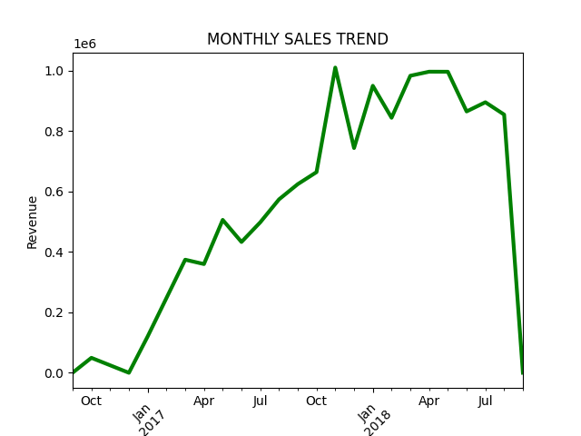
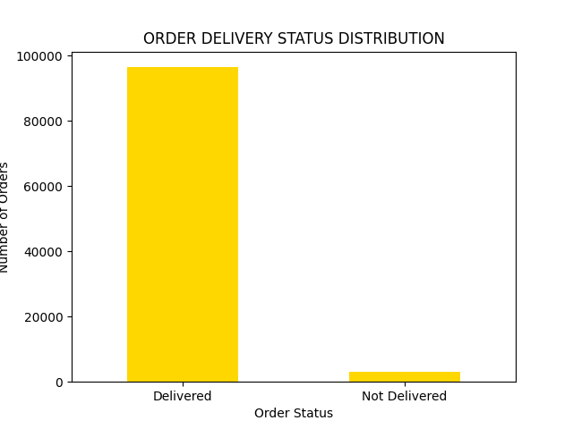
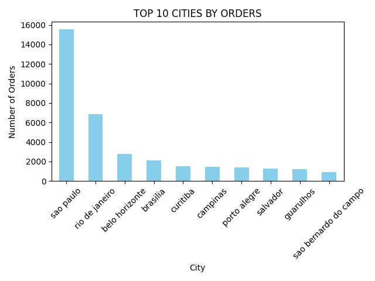
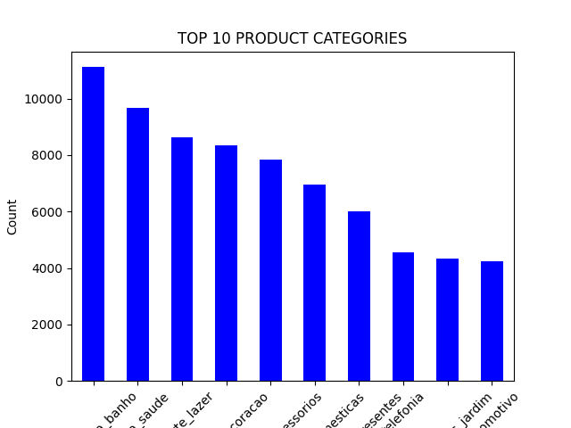
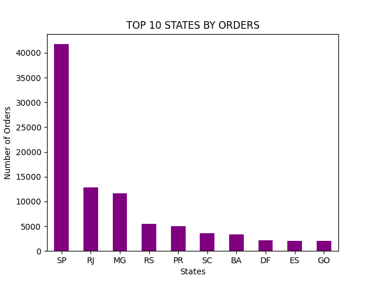

## **E-commerce Data Analysis Project**

#### **Overview**

Analyzed Brazilian e-commerce dataset to understand sales trend, 

customer behaviour, and business performance

using Python and SQL.

#### **Tools Used**

* Python
* Pandas
* Matplotlib
* MySQL

#### **Key Analysis**

###### **Top Cities \& States**

* Sao Paulo dominates orders
* High concentration in SP state

###### **Delivery Analysis**

* 96 % orders successfully delivered.

###### **Revenue Analysis**

* Total revenue = 13.59 million

###### **Sales Trend**

* Increasing trend over time
* Peak in early 2018

###### 

###### **Product Analysis**

* Top categories identified

#### **SQL Queries Used**

SELECT COUNT(\*) FROM orders;

SELECT customer\_state, COUNT(\*)

FROM customers.c

JOIN orders o ON c.customer\_id = o.customer\_id
GROUP BY customer\_state;

#### **Visualizations:**

###### **Sales Trend**

###### **Delivery Status**

###### **Top 10 Cities**

###### **Top Products**

###### **Top 10 States**

#### **Insights:**

* Business is highly concentrated in Sao Paulo
* Strong delivery performance
* Growing sales trend over time

